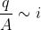
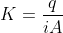
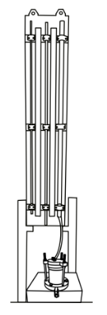
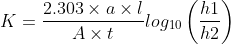

### INTRODUCTION

#### Darcy's Law

Darcy experimentally demonstrated that the rate of flow of water through a soil medium per unit cross-sectional area is directly proportional to the applied hydraulic gradient.

Thus, the discharge per unit area is proportional to the hydraulic gradient, and can be expressed as:

 

Where, 
&nbsp;&nbsp;&nbsp;&nbsp;&nbsp;&nbsp;&nbsp;&nbsp;&nbsp;&nbsp;&nbsp;&nbsp;&nbsp;&nbsp;q = Rate of flow of water 
&nbsp;&nbsp;&nbsp;&nbsp;&nbsp;&nbsp;&nbsp;&nbsp;&nbsp;&nbsp;&nbsp;&nbsp;&nbsp;&nbsp;A = Cross-sectional area of the soil 
&nbsp;&nbsp;&nbsp;&nbsp;&nbsp;&nbsp;&nbsp;&nbsp;&nbsp;&nbsp;&nbsp;&nbsp;&nbsp;&nbsp;i = Hydraulic gradient

To eliminate the proportionality in the equation, a constant is introduced, known as Darcy's coefficient of permeability, also referred to as the coefficient of permeability or simply permeability.

  
q = kiA

Permeability may be defined as the property of soil that indicates the ease with which water can flow or percolate through the continuously interconnected pore spaces of the soil. It can also be expressed as the ratio of the rate of flow of water to the product of the cross-sectional area and the hydraulic gradient.

 

The permeability of soil depends on several factors, including the grain size of soil particles, the properties of the pore fluid, the void ratio of the soil, the shape and arrangement of the pores, and the degree of saturation.

In the laboratory, the permeability of soil is determined using either of the following two methods:

##### Constant Head Permeability Test

In this method, a constant water head is maintained in an overhead tank to ensure that the pressure remains uniform throughout the experiment. This test is generally conducted for coarse-grained soils, where the permeability is relatively high.

##### Variable Head Permeability Test

In this method, a standpipe is connected to the permeameter to supply water. The head of water varies with time, and the test is typically used for fine-grained or cohesive soils, where the permeability is very low.

| Type of soil |  Permeability (cm/s) |
|:------------:|:--------------------:|
| Gravel | 1 |
| Coarse sand | 1 to 0.1 |
| Medium sand | 10-1 to 10-2 |
| Fine sand | 10-2 to 10-3 |
| Silty sand | 10-3 to 10-4 |
| Silt | 10-5 |
| Clay | 10-7 to 10-9 |

#### Falling Head Permeability

The falling head permeability test is a commonly used laboratory method for determining the permeability of fine-grained soils such as silt and clay, which contain little or no granular material.

  

In this method, the time required for the water level in the standpipe to fall through a specified length is measured as water percolates through the soil sample.

The coefficient of permeability is calculated using the following expression:

  

Where, 
&nbsp;&nbsp;&nbsp;&nbsp;&nbsp;&nbsp;&nbsp;&nbsp;&nbsp;&nbsp;&nbsp;&nbsp;k = Coefficient of permeability 
&nbsp;&nbsp;&nbsp;&nbsp;&nbsp;&nbsp;&nbsp;&nbsp;&nbsp;&nbsp;&nbsp;&nbsp;Q = Total quantity of water collected in time t 
&nbsp;&nbsp;&nbsp;&nbsp;&nbsp;&nbsp;&nbsp;&nbsp;&nbsp;&nbsp;&nbsp;&nbsp;l = Length of the soil sample 
&nbsp;&nbsp;&nbsp;&nbsp;&nbsp;&nbsp;&nbsp;&nbsp;&nbsp;&nbsp;&nbsp;&nbsp;t = Duration of water collection 

This method is particularly suitable for soils with low permeability.